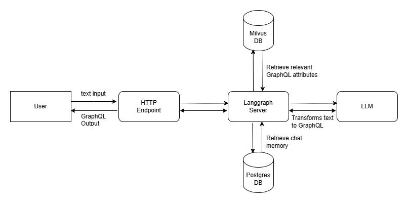

# Shopify LLM GraphQL Builder

This is my attempt to build a chat system that accepts user natural language input
and transforms them into valid Shopify GraphQL Admin APIs.

The problem is that there are thousands Shopify API attributes; thus, it is not efficient
nor cost-effective to include all attributes and their descriptions into the LLM prompt.

To solve the problem, I am using Retrieval Augmented Generation (RAG) to index the
API attributes into a vector database, then only pick top-N attributes that are
most relevant to user queries to be injected into the LLM prompt. Using the enriched
prompt, the LLM will build the GraphQL that are most relevants to user query input.


# Architecture

The system consists of:
- an Express JS server that processes HTTP chat requests
- a SQL database to handle user chat memory
- a vector database that keeps Shopify GraphQL attributes translates a sentence into
- a Langgraph framework that orchestrates:
  - an LLM model that breaks down user queries into multiple single elements
  - an LLM model that is injected with attributes from vector database to build Shopify Admin GraphQL API Requests




# Setup Instruction

Before 1st step, make sure that you have populated all .env variables

## To populate Milvus vector database:
1. Run `pipenv shell`
2. Run `pipenv install`
3. Run `python scripts/milvus.py`

## To migrate PostgreSQL database:
1. Run `npm run migrate`
2. Run `ts-node scripts/init_test_user.ts` to create a test user and channel

## To run server:
Run `npm run dev`


# Usage Instruction

** REQUEST **
```
curl -XPOST http://localhost:3000/graphql  -H "Content-Type: application/json" \
-d '{"user_channel_id": 1, "content": "Give me the last 5 orders, each with the \
customer name"}'
```

** RESPONSE **
```
{
  "role":"ai",
  "id":4,
  "userChannelId":1,
  "content":"query {
    orders(last: 5) {
        nodes {
            id
            name
            email
        }
        pageInfo {
            hasPreviousPage
            hasNextPage
            startCursor
            endCursor
        }
    }
  }"
}
```
